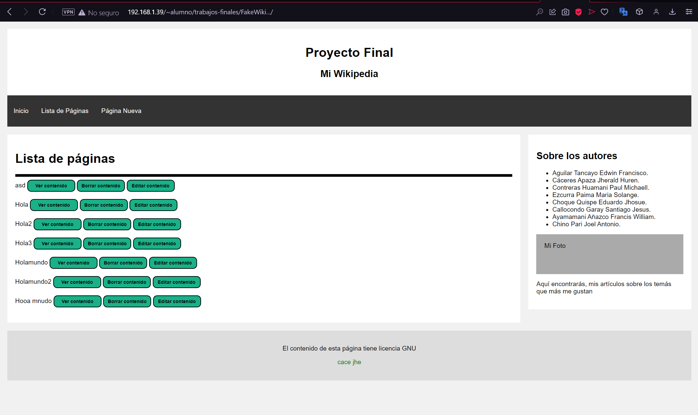

<table>
    <theader>
        <tr>
            <td></td>
            <th>
                UNIVERSIDAD NACIONAL DE SAN AGUSTIN 
                FACULTAD DE INGENIERÍA DE PRODUCCIÓN Y SERVICIOS 
                ESCUELA PROFESIONAL DE INGENIERÍA DE SISTEMAS
            </th>
            <td></td>
        </tr>
    </theader>
    <tbody>
        <tr><td colspan="3">Formato: Guía de Práctica de Laboratorio</td></tr>
        <tr><td>Aprobación:  2022 </td><td>Código: GUIA-PRLD-001</td><td>Página: 1</td></tr>
    </tbody>
</table>

 <h3>INFORME DE LABORATORIO</h3>

<table>
 <theader>
  <tr><th colspan="6" bgcolor="red">INFORMACIÓN BÁSICA</th></tr>
 </theader>
 <tbody>
  <tr><td>ASIGNATUA:</td><td colspan="5">Programacion Web 1 </td></tr>
  <tr><td>TÍTULO DE LA PRACTICA:</td><td colspan="4">Proyecto final (III Entrega) <td></tr>
  <tr><td>NÚMERO DE PRÁCTICA:</td><td>Practica de Laboratorio 14</td><td>AÑO LECTIVO:</td><td>2022-B</td><td>NRO. SEMESTRE:</td><td>II</td></tr>
  <tr><td>FECHA DE PRESENTACIÓN:</td><td> 26-Dic-2022</td><td>HORA DE PRESENTACIÓN:</td><td colspan="3">6:30 p.m.</td></tr>

  <tr><td>INTEGRANTES:</td><td colspan="3">Aguilar Tancayo Edwin Francisco.  Cáceres Apaza Jherald Huren. Contreras Huamani Paul Michaell.
    Ezcurra Paima Maria Solange.  Choque Quispe Eduardo Jhosue.   Callocondo Garay Santiago Jesus.   Ayamamani Añazco Francis William.   Chino Pari Joel Antonio. </td><td>NOTA:</td><td>...</td></tr>

  <tr><td>DOCENTE:</td><td colspan="5">Richart Smith Escobedo Quispe - rescobedoq@unsa.edu.pe</td></tr>
 </tbody>
</table>
<table>
 <theader>
  <tr><th>SOLUCIÓN Y RESULTADOS</th></tr>
 </theader>
 <tbody>
  <tr><td><strong>I. SOLUCIÓN DE EJERCICIOS/PROBLEMAS:</strong> 
  <ul>
    <h1>  Video  </h1> 
         
Video de demostracion del proyecto

             <h4>https://drive.google.com/file/d/15gzhtDVuYtSsirTpFJypyPI9D9xLyRkN/view?usp=share_link</h4>
    <h1>  Inicio  </h1> 
      
 Pagina de Inicio. 

          
    <h1>  Login  </h1> 
      
 Pagina de Ingresar. 

          
    <h1>  Register  </h1> 
      
 Pagina de Registro. 

          
    <h1>  After Login  </h1> 
      
 Pagina del usuario creado. 

          
    <h1>  List  </h1> 
      
 Lista de paginas. 

             
    <h1>  New  </h1> 
      
 Nueva pagina. 

           
    <h1>  Editor de contenido  </h1> 
      
 Modificar contenido de las paginas. 

                                               
  </ul>
  <tr><td><strong>II. CONCLUSIONES:</strong> - Podemos concluir que el desarrollo 
  de paginas web en el front y back end, para el uso de HTML. CSS, JavaScript, los CGIs,
  Perl, y el uso de las bases de datos, nos ayudan a completar funcionalidades a paginas como la creada.  </td></tr>
 </tbody>
</table>

<table>
 <theader>
  <tr><td><strong>III. RETROALIMENTACIÓN GENERAL</strong> 
  </td><tr>
 </theader>
 <tbody>
  <tr><td>- ......................................
  </td></tr>
 </tbody>
</table>

<table>
 <theader>
  <tr><td><strong>REFERENCIAS Y BIBLIOGRAFÍA</strong></td><tr>
 </theader>
 <tbody>
  <tr><td>https://cgi-lib.berkeley.edu/</td></tr>
  <tr><td>https://www.blyx.com/public/docs/expresiones_regulares_perl.html</td></tr>
  <tr><td>http://www.w3big.com/es/perl/perl-regular-expressions.html#gsc.tab=0</td></tr>
 </tbody>
</table>

